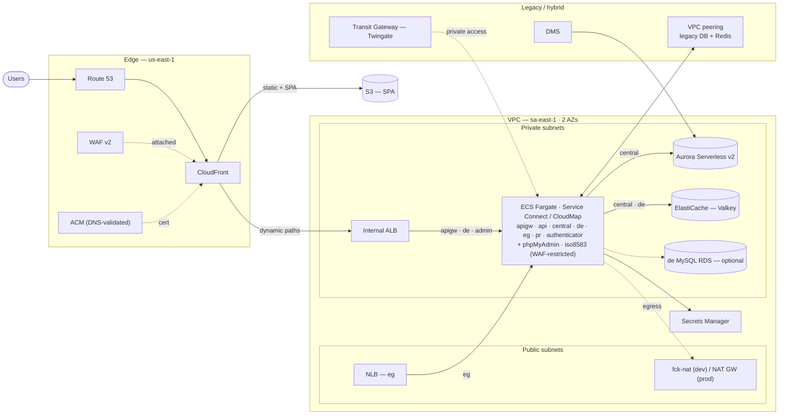
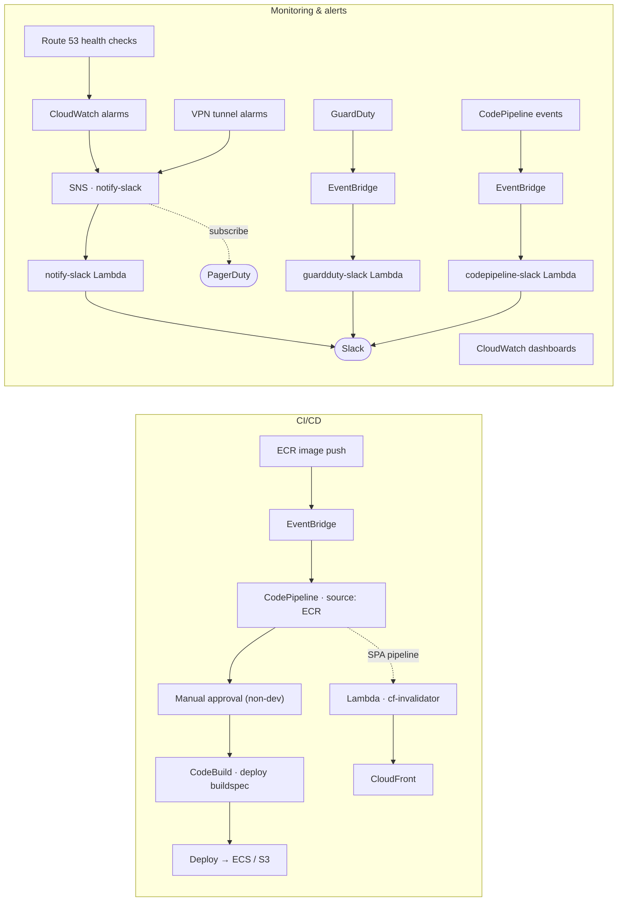

# acme — AWS infrastructure (OpenTofu)

A sanitized showcase of how I design and run production AWS infrastructure with
OpenTofu. It is a faithful copy of a real multi-account, multi-region platform,
with every client identifier replaced by an obvious placeholder.

> **Nothing real is in here.** Project name `acme`, domain `example.com`,
> account IDs `111111111111` / `222222222222` / `333333333333`, public IPs in the
> RFC 5737 ranges (`192.0.2.0/24`, `198.51.100.0/24`, `203.0.113.0/24`), and all
> resource IDs / secrets are placeholders. The `service-configs/` and `*.tfvars`
> values are fake. Real secrets never live in the repo — they go to AWS Secrets
> Manager and a gitignored `secrets*.tfvars`.

## What this is

One OpenTofu root config for a containerised web platform, laid out
service-per-file at the repo root (`vpc.tf`, `ecs.tf`, `rds.tf`, …). One
codebase serves every environment; `dev` and `prod` differ only by a `.tfvars`
file and a set of `enable_*` feature flags. State is plan/validate-only here —
there is no backend wired up, so it verifies fully offline with no AWS account
(see [How to verify](#how-to-verify)).

It covers four scenarios end to end:

- **Web app** — Fargate (`ecs.tf`) running 9 services generated from a map,
  behind an ALB (`alb.tf`) and CloudFront (`cloudfront.tf`), with ACM
  (`acm.tf`), Route 53 (`route-53.tf`), Aurora Serverless v2 + provisioned
  (`rds.tf`), ElastiCache/Valkey (`elasticache.tf`) and S3 (`s3.tf`).
- **Networking** — VPC with public/private subnets (`vpc.tf`), `fck-nat` for
  non-prod egress (NAT Gateway in prod), VPC flow logs to S3, a Transit Gateway
  attachment for private connectivity, cross-account peering to legacy DB/Redis
  (`modules/vpc-peering-for-legacy-db-redis-servers`), and DMS for database
  migration (`dms.tf`).
- **CI/CD** — CodePipeline + CodeBuild + ECR (`cicd.tf`) driven by the
  buildspecs in `buildspecs/`, plus a credential-free GitHub Actions gate
  (`.github/workflows/validate.yml`).
- **Security & alerts** — WAFv2 (`waf.tf`), GuardDuty (`guardduty.tf`),
  account hardening (`account-security.tf`), CloudWatch alarms + dashboards
  (`cloudwatch*.tf`), VPN tunnel alarms (`cloudwatch-vpn.tf`), and SNS → Slack
  notifications via small Go lambdas (`slack.tf`, `lambda.tf`).

## Architecture

Both diagrams render on GitHub. Every name is a sanitized placeholder.

### Runtime



Request path: Route 53 → CloudFront (WAF + ACM) → S3 for the SPA, or the internal ALB for dynamic paths → ECS Fargate. Every Fargate service joins the same CloudMap namespace (Service Connect); only `apigw`, `de`, `eg`, and the WAF-restricted admin tools sit behind a load balancer — the rest are reachable by service discovery only. Aurora Serverless v2 backs the `central` service; ElastiCache (Valkey) backs `central` and `de`. Legacy systems connect over cross-account VPC peering and a Transit Gateway (Twingate), with a DMS migration into Aurora.

### Delivery & alerts



An image push to ECR triggers the pipeline through EventBridge (non-dev waits on a manual approval); the SPA pipeline also invalidates CloudFront via a Lambda. CloudWatch alarms plus the VPN and Route 53 health checks fan out through SNS to a notify-slack Lambda and PagerDuty; GuardDuty findings and CodePipeline events post to Slack through their own small Go lambdas.

Region split: WAF, ACM, CloudFront, and one notify-slack/PagerDuty stack run in `us-east-1`; everything else in `sa-east-1`. Route 53 NS records are delegated from the master-payer account.

## Design decisions worth calling out

- **One config, many environments.** Everything is gated by `enable_*` flags and
  fed by per-env `.tfvars`. `dev.tfvars` turns most extras off to stay cheap;
  `prod.tfvars` turns everything on. No copy-paste per environment.
- **Services from a map.** `ecs.tf` builds every ECS service with `for_each`
  over `var.services`, so adding a service is a one-line change. Per-service CPU,
  memory, ports, scaling, and repo are all driven from maps in `variables.tf`.
- **Module versions are pinned in one place.** `var.module_sources` holds the
  source + version for every `terraform-aws-modules/*` and community module, so
  upgrades are a single, reviewable diff.
- **Cost-aware networking.** Non-prod uses `fck-nat` (a NAT instance) instead of
  a managed NAT Gateway; prod uses the managed NAT Gateway. Same code, switched
  on `var.tags.environment`.
- **Encryption via module settings, not a separate `kms.tf`.** KMS shows up
  where it belongs — Aurora storage, CloudWatch log groups, EBS defaults — rather
  than as a standalone file.
- **Legacy integration.** The config can attach to a pre-existing VPC
  (`use_existing_vpc`), peer into legacy DB/Redis, run DMS migrations, and alarm
  on out-of-band Site-to-Site VPN tunnels — the messy reality of moving a real
  platform onto OpenTofu.
- **Defence in depth.** WAF managed rules ship in count mode and flip to block
  per-env once metrics are clean; GuardDuty, EBS public-access blocks, and SSM
  document-sharing locks are toggled on for the primary env per account.

## Layout

```
.
├── variables.tf            # all inputs, the module_sources map, enable_* flags
├── versions.tf             # OpenTofu + provider pins, empty s3 backend
├── providers.tf            # default + us-east-1 + master-payer providers
├── dev.tfvars / prod.tfvars
│
├── vpc.tf ecs.tf alb.tf cloudfront.tf acm.tf route-53.tf
├── rds.tf dms.tf elasticache.tf s3.tf            # web app + data
├── cicd.tf buildspecs/                           # CI/CD
├── waf.tf guardduty.tf account-security.tf       # security
├── cloudwatch*.tf lambda.tf slack.tf secrets-manager.tf
│
├── modules/
│   ├── tls-cert/                                   # ACM + Route 53 DNS validation
│   ├── rds-scheduler/                              # start/stop RDS on a schedule
│   └── vpc-peering-for-legacy-db-redis-servers/    # cross-account peering
│
├── service-configs/        # per-service env/JSON/YAML (placeholder values)
├── lambda-functions/go/     # Go lambda placeholders (handler + build wiring)
└── .github/workflows/validate.yml
```

## How to verify

Everything below runs offline with no AWS credentials. `tofu validate` is the
gate — it downloads providers and modules and type-checks the whole config.

```sh
mise install                              # opentofu, tflint, trivy, pre-commit, ...

tofu fmt -check -recursive                # formatting
tofu init -backend=false && tofu validate # the gate (root)
for m in modules/*/; do (cd "$m" && tofu init -backend=false && tofu validate); done

tflint --init && tflint --recursive       # lint
trivy config .                            # IaC security scan
pre-commit run --all-files                # everything above, as hooks
```

## Remote state (not wired up here)

The backend is intentionally left empty so config is passed at init time per
environment:

```sh
tofu init \
  -backend-config="bucket=acme-tfstate-prod" \
  -backend-config="key=acme/prod/terraform.tfstate" \
  -backend-config="region=sa-east-1" \
  -backend-config="use_lockfile=true"
```

Deploys use GitHub OIDC (no long-lived keys). The apply workflow isn't shipped
here because it needs an account, but the shape is:

```yaml
permissions:
  id-token: write
  contents: read
steps:
  - uses: actions/checkout@v4
  - uses: aws-actions/configure-aws-credentials@v4
    with:
      role-to-assume: arn:aws:iam::222222222222:role/github-actions-tofu
      aws-region: sa-east-1
  - uses: opentofu/setup-opentofu@v1
  - run: tofu init -backend-config="bucket=acme-tfstate-prod" -backend-config="key=acme/prod/terraform.tfstate"
  - run: tofu apply -var-file=prod.tfvars -auto-approve
```

## Reference

Every input is declared and described in [`variables.tf`](variables.tf) — the
`enable_*` flags, the `module_sources` version map, and the per-service maps.

(`terraform-docs` isn't wired in on purpose: this config uses OpenTofu's support
for variables in module `source`/`version`, which `terraform-docs` can't parse.
`tofu validate` accepts it.)
