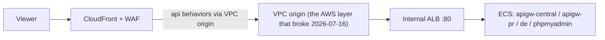
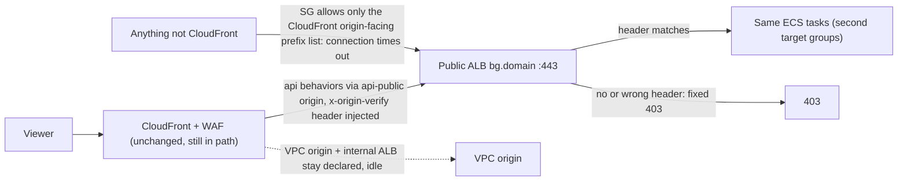

# CloudFront VPC-Origins break-glass

When AWS's CloudFront VPC-Origins layer breaks (2026-07-16 incident: API timeouts in every env for ~3h with no lever on our side), flip `enable_breakglass_public_alb` per env to repoint CloudFront's `api` traffic to a parallel internet-facing ALB. CloudFront + WAF stay in path the whole time.

What the flag builds: internet-facing ALB (SG ingress = CloudFront origin-facing prefix list :443 only), HTTPS listener that answers a fixed 403 unless the request carries the `x-origin-verify` secret CloudFront injects, its own target groups for `apigw-central` / `apigw-pr` / `de` / `phpmyadmin`, a `bg.<domain>` alias, and the CloudFront swap to the `api-public` origin. Flag off destroys all of it and points behaviors back at the VPC origin — no VPC-origin recreate on revert, fresh secret on the next activation. The `bg.` hostname rides the `aws.example.com` tree where the env dual-runs it, else `bg.<domain_name>`.

Scope notes: envs without CloudFront have nothing to flip. The standalone phpMyAdmin stacks (own distro + own internal ALB) are NOT covered — DB fallback there during a VPC-Origins outage is the RDS Data API or the local mysql pattern.

## Traffic path — before and after

Normal (flag off):

Break-glass (flag on):

## When there's an outage

1. `aws health describe-events --filter services=CLOUDFRONT --region us-east-1 --profile acme-prod` — confirm it's an AWS VPC-Origins event (timeouts, ALL envs at once). Don't flip for 403s or single-env errors — those are us, not AWS.
2. Set `enable_breakglass_public_alb = true` in `acme-<env>.tfvars` → commit + push. **CI is the primary path** — an unpushed local flip is silently reverted (outage returns) by the next `main` apply. Local `./scripts/acme-<env>.sh apply` only if CI is unavailable, then push the tfvars line right after.
3. **Prod envs with a live DMS replication: CI only, no local apply** — local applies re-assert the DMS endpoint passwords; `ModifyEndpoint` is rejected mid-run and fails the activation.
4. `aws elbv2 describe-target-health --target-group-arn $(aws elbv2 describe-target-groups --names <project>-<env>-bg-apigw-c --query 'TargetGroups[0].TargetGroupArn' --output text --profile <profile>) --profile <profile>` — bg targets healthy (repeat for `-bg-apigw-pr` / `-bg-de` / `-bg-pma`).
5. `curl -s -o /dev/null -w '%{http_code}\n' https://<domain>/api/v1/version` — 200 through CloudFront via the public origin.
6. `curl -s -o /dev/null -w '%{http_code}\n' https://<domain>/phpmyadmin/` — reachable over Twingate; 403 from a non-allowlisted IP (WAF gate intact — it's distribution-level, unaffected by the origin type).
7. `curl -sv --connect-timeout 5 https://bg.<domain>/` — from your machine this must TIME OUT (SG only admits CloudFront's origin-facing ranges).
8. Tell the team in #deployments; for prod, loop in the PM for client comms.

## When the outage is resolved

1. `aws health describe-events --filter services=CLOUDFRONT --region us-east-1 --profile acme-prod` — event shows resolved/closed.
2. Set the flag back to `false` → commit + push. CI repoints behaviors to the VPC origin and destroys the bg ALB, `bg.` record, and secret. The plan must show the CloudFront distribution updating in place — **no VPC-origin replace**.
3. `curl -s -o /dev/null -w '%{http_code}\n' https://<domain>/api/v1/version` — 200 via the VPC origin; bg ALB gone.
4. Log the measured activation/revert timings below.

## Notes

- QA-trio envs may be scaled to 0 off-hours (bg target groups come up empty) — this is mostly a prod lever.
- If the CloudFront control plane is also down, the behavior repoint stalls (the bg ALB still builds); direct header-authed access to `bg.<domain>` is the last resort.
- `iso8583-playground` paths 404 during break-glass (dev-only load-test tool). The bg ALB has no CloudWatch alarms, and request-count autoscaling keeps tracking the main ALB.
- Cost: $0 while off; ~$25-30/mo per env only while activated.

## Measured timings (dev-env live-fire, 2026-07-16)

- Activation apply: ~6 min (ALB create 3m08s is the long pole; CloudFront repointed in-place at ~1 min).
- First 200 through the break-glass path: ~7 min after apply start (apigw-central target healthy on the 2×15s checks).
- pma tail: expect +3-5 min on top (apache boot is the slowest to come healthy).
- Revert apply: 2m25s (`0 added, 17 destroyed`, CloudFront update in-place, NO VPC-origin recreate); endpoints served 200 via the VPC origin immediately after.
- ECS races the listener rules on activation ("target group does not have an associated load balancer" mid-apply) — the provider retries through it; a converged re-apply also finishes the job in ~1m40s.
